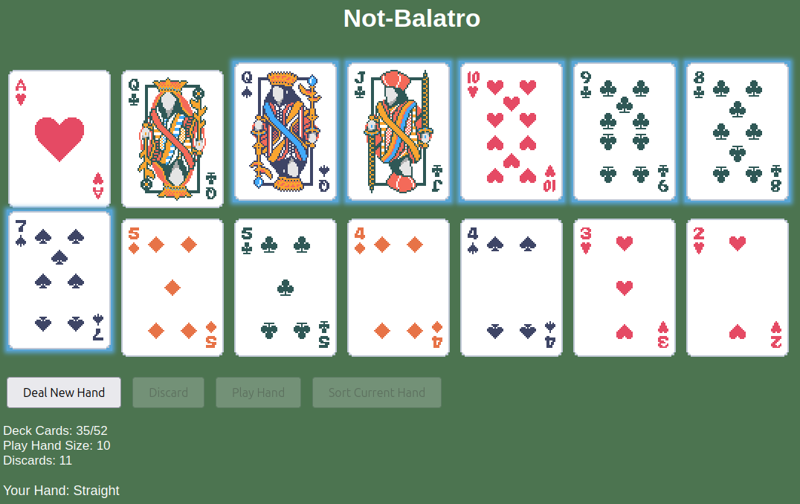

# Not-Balatro

I really like [Balatro](https://www.playbalatro.com/)'s main idea of picking Poker and breaking [almost all] its rules, in a fun and addictive way, so I thought that it would be a nice exercise to replicate it: Start by building a basic poker game, then rework the internals so most rules can be altered.

The result is this (work in progress) repository: A simple poker game with hackable rules, and a Balatro look'n feel as a tribute. I don't know how far I'll go, e.g. if I will implement Jokers or not, but I will try to have at minimum "fully hackable" ranking and scoring.

You can try it out [here](https://kartones.net/demos/030/). At the moment, if you want to hack the game, open the browser developer tools and go on from there.



## Setup

For local development, install [pnpm](https://pnpm.io/) and run:

```bash
pnpm install
```

## Run

### Local

```bash
./node_modules/http-server/bin/http-server
```

And then you have a local http server, to properly load module JS files.

### Remote/Deployment

You simply need to deploy the following files and folders (after all, it's all HTML, JS and CSS) in some form of web server:

```
index.html
css/
img/
js/
```

## Test

Tests written and run using NodeJS [built-in test runner](https://nodejs.org/docs/latest-v20.x/api/test.html) and [assertions library](https://nodejs.org/docs/latest-v20.x/api/assert.html).

```bash
node --test
```

## Roadmap

- (WIP) Flexible scoring rules: As the number of played cards is hackable, scoring rules can become way complex (e.g. allow for "N of a kind", for an arbitrary N). The system should allow flexibility for up to 10 cards or so.
- (WIP) More tests at minimum for the full game rules and played hand evaluation.
- Show scored value of played hand.
- Hack panel: Instead of relying on the browser developer tools console, provide an easy way to hack all available parameters.
- Code refactor: [Claude 3.5](https://claude.ai/) gives you a great wow-effect when it first generates a fully working poker game prototype, but the code quality isn't that great. In any case, I'm up for the challenge of refactoring AI-generated "game code".
- And of course, more hacks and tweaks.